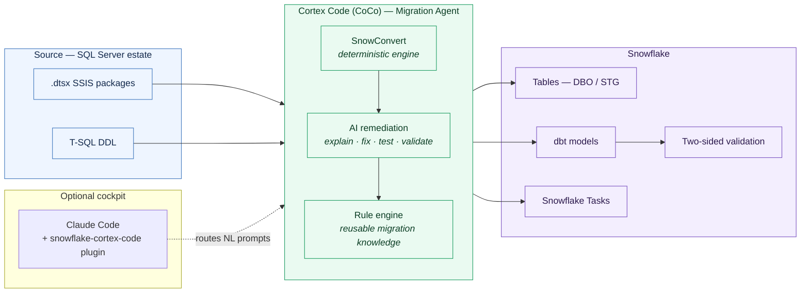
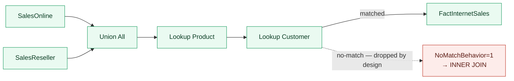

# SSIS → Snowflake Migration POC
### ETL pipeline modernization (SSIS → dbt) with the Snowflake Migration Agent in Cortex Code (CoCo)

A hands-on proof-of-concept that runs a **SQL Server / SSIS → dbt-on-Snowflake** migration end to end through the
**Migration Agent** in **Cortex Code (CoCo)**, with **Claude Code as an optional single-window cockpit**. This repository
is less about a score and more about **method** — how the workflow is driven, where the deterministic engine ends and AI
begins, what an architect verifies at each gate, and the practical lessons that only surface by actually running it.

---

## The operating principle

Modern ETL migration is not "point AI at it and hope." The approach that holds up in practice is **layered**:

- **SnowConvert performs the deterministic conversion first.** It is rule-based, repeatable, and auditable — the same
  input yields the same output. This is the trustworthy foundation.
- **AI remediates around it** — explaining remaining issues, generating the dbt model bodies that implement each
  package's data flow, suggesting fixes, and validating behavior. Bounded, reviewable, and always under architect judgment.

We hold this boundary deliberately throughout the repo:

> **Claude Code is the *optional* cockpit; Cortex Code (CoCo) runs the migration agent; SnowConvert converts
> deterministically and AI remediates around it. AI-assisted, not AI-magic.**

What the tooling removes is **coordination overhead** — sequencing, conversion mechanics, test generation. What it does
not remove, and shouldn't, is the **architect's judgment**: deciding what "correct" means and proving the converted
pipeline preserves real source behavior.

---

## Architecture

---

## The methodology — stage by stage

The agent is an intelligent migration orchestrator that maintains persistent project state across stages. An engagement
is **architect-driven and agent-executed**: the SA frames each step in natural language, verifies the output, and gates
before proceeding.

| Stage | What the agent does | What the architect owns |
|-------|---------------------|--------------------------|
| **Connect / Init** | Establishes connections; initializes the project + registry | Confirm the connection resolves to the *intended* account/role; confirm the inference connection is set |
| **Register / Import** | Ingests DDL + ETL packages into project state | Reconcile registered count vs. inventory — **flag anything that scanned but didn't register** |
| **Convert SQL** | Deterministic SnowConvert of T-SQL → Snowflake SQL | Review conversion issues (EWIs) and functional differences (FDMs) by category |
| **Assess** | Workload inventory, dependencies, SSIS classification, **deployment waves** | Confirm classifications and effort are defensible; this is the heart of an ETL engagement |
| **Migrate** | Deploys objects; loads data in dependency order | Verify topological/FK ordering; confirm objects land where expected |
| **Modernize ingestion** | AI generates the **dbt model bodies** from each package's data flow | Read the models — confirm they faithfully implement source → transform → load |
| **Validate** | Two-sided / row-count testing vs. the source | Confirm checks pass *or* every difference is predicted and signed off |

The **rule engine** is the scale lever: once a remediation is approved for one package, it can be extracted as reusable
knowledge and propagated across the many similar packages in a real estate. A four-package POC barely touches this; an
enterprise estate lives or dies by it.

---

## What we actually learned (the part worth reading)

These are the practical lessons from running the workflow — the things documentation doesn't tell you and a competent
SA manages rather than fears.

**1. There are two connections, not one — and they're easy to confuse.**
The agent's **inference** connection (which account its AI calls run against) is configured separately from the **SQL**
connection. If the inference connection is unset or wrong, work routes to the wrong account even while the SQL side looks
perfectly fine. Treat "two connections, two purposes" as a gate at Connect, not a footnote.

**2. Deterministic conversion produces a skeleton — AI fills the body.**
SnowConvert reliably emits the converted DDL, Snowflake Task definitions, and ETL scaffolding. It does **not** hand you a
finished dbt model; the **model body** — the actual SELECT implementing the data flow — comes from the AI-remediation
step. Knowing exactly where that line sits keeps expectations (and demos) honest: "converted" is not the same as "runnable."

**3. Not every package auto-registers, and that's a signal, not a surprise.**
Complex and flat-file packages are more sensitive to the parser. One of ours (a pure flat-file ingestion package) scanned
but did not register, and we **deferred it deliberately** rather than force it. The discipline is to reconcile registered
vs. expected at the Register gate and disposition each gap — substitute, remediate, or defer with a reason.

**4. Fidelity beats a clean-looking result.**
The most instructive moment: a fact-table load that legitimately dropped rows. The source SSIS package drops sales whose
customer isn't found (a lookup "no-match"), and the generated dbt model preserved that exactly via an **INNER JOIN**. The
migration that would have *looked* better — forcing every row through — would have been **wrong**, inventing relationships
that don't exist in the source. We predicted the drop, validated it, and accounted for every dropped row. **Preserving
real referential behavior, and proving it, is what separates a migration you can trust from one that just looks clean.**

**5. The agent adapts targets to real data — review those adaptations.**
During the run the agent widened target columns to fit values the source transforms produce (e.g., a cleaned status
value longer than the original column). Sensible remediations, but exactly the kind the architect should see and confirm,
not rubber-stamp.

**6. Validation is the trust anchor.**
Two-sided testing (source vs. target) is what lets you stand behind the result. A *difference is not automatically a
failure* — expected differences must be predicted, explained, and signed off, never silently "fixed" into a false match.

---

## How lookup fidelity shows up in practice

The converted dbt model reproduces the source lookup's drop behavior rather than masking it — and validation is what
turns "rows are missing" into "rows are correctly absent, and here's why."

---

## Repository structure

| Path | Contents |
|------|----------|
| [`CLAUDE.md`](CLAUDE.md) | Project context + framing rules (cockpit vs. agent; deterministic-then-AI) |
| [`RUNBOOK.md`](RUNBOOK.md) | Gated execution log (G0–G5) — the real, step-by-step run record |
| [`source_ssis/`](source_ssis) | SSIS `.dtsx` packages (AdventureWorksDW dimensional schema) + companion docs |
| [`sql/`](sql) | T-SQL source DDL |
| [`reports/converted/`](reports/converted) | Deterministic SnowConvert output (DDL, Task defs, ETL scaffolding) |
| [`reports/stage6_results/`](reports/stage6_results) | Deployment, dbt-run, and validation artifacts + the dbt projects |
| [`docs/ENTERPRISE_ETL_MIGRATION_PLAYBOOK.md`](docs/ENTERPRISE_ETL_MIGRATION_PLAYBOOK.md) | Enterprise SA methodology (SSIS/Informatica → dbt) — discovery to cutover |
| [`demo_script/`](demo_script) | Live-demo run script + walkthrough |

---

## Scope

- **Source system: SQL Server only.** Other RDBMS exist in the broader migration matrix but are out of scope for this practice.
- **Focus: ETL pipeline modernization** (SSIS → dbt), with the **embedded SQL** converted by SnowConvert for the SQL
  Server dialect — the ETL conversion and the SQL-dialect conversion are linked, not separable.
- **This is a methodology POC, not a scale benchmark.** It validates *how* the workflow runs and what an architect owns
  at each step; a production engagement registers against the live SQL Server estate and runs under enterprise RBAC. The
  full delta and the discovery-to-cutover method are in the [playbook](docs/ENTERPRISE_ETL_MIGRATION_PLAYBOOK.md).

---

*Built to validate the method, and to be honest about where the tooling ends and the architect begins.*
